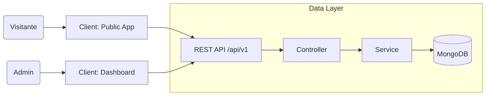

# 🚀 Portfolio Platform & CMS


> **A high-performance, modular personal brand platform built to demonstrate advanced Full-Stack architecture capability.**
> Combines a high-conversion public frontend with a secure, authentication-protected dedicated Admin Dashboard for real-time content management.

---

## 🚀 Overview

**The Challenge:**
Most developer portfolios are static, making updates tedious and often resulting in outdated content. Dependencies on external CMS systems often bloat the tech stack and reduce performance.

**The Solution:**
A custom-built **Headless CMS architecture** that serves two distinct apps from a unified backend:
1.  **Public Showcase:** A server-side optimized, responsive application for visitors.
2.  **Admin Console:** A protected, feature-rich dashboard for the owner to manage projects, skills, and messages.

**Target Audience:**
Hiring Managers and Tech Leads looking for proof of **System Design**, **Database Architecture**, and **Clean Code** skills.

---

## 🧰 Tech Stack

Built with a focus on performance, scalability, and type safety.

| Layer | Technology | Rationale |
|:--- |:--- |:--- |
| **Frontend** | **React 18 + Vite** | Fast HMR, Component Composition, Custom Hooks |
| **Styling** | **Tailwind CSS** | Utility-first, responsive design system, dark mode |
| **Backend** | **Node.js + Express** | Event-driven non-blocking I/O, RESTful API design |
| **Database** | **MongoDB + Mongoose** | Flexible schema, Aggregation pipelines for analytics |
| **Security** | **JWT (Access/Refresh)** | Stateless authentication, Bcrypt hashing, Helmet headers |
| **Uploads** | **Multer + Sharp** | Image processing and optimized storage streaming |
| **Deploy** | **Docker / Railway** | Containerized environment, CI/CD ready flow |

---

## 🔥 Key Features

### 🎨 Visitor Experience (Public)
*   **Dynamic Routing**: SEO-friendly detail pages for every project (`/proyecto/:slug`).
*   **Smart Filtering**: Real-time project categorization (Frontend/Backend/Fullstack).
*   **Interactive UI**: Micro-interactions, hover effects, and smooth scrolling.
*   **Optimized Assets**: Lazy loading images and code splitting for <1s LCP.

### 🛡️ Owner Control (Admin)
*   **Secure Auth Gate**: Protected routes with persistent session management.
*   **CRUD Operations**: Full lifecycle management for Projects, Experience, and Skills.
*   **Dashboard Analytics**: At-a-glance view of portfolio stats (Active projects, messages).
*   **Message Center**: Integrated inbox for contact form submissions.

---

## 🧠 Architecture (High Level)

The system works on a loosely coupled **Client-Server** model.



*   **Frontend**: Consumes API via a unified `ApiService` class with interceptors for error handling.
*   **Backend**: Controller-Service-Repository pattern (simplified) to decouple business logic from Express routes.
*   **State Management**: React Context (`AuthContext`) for global session state; scoped state for UI components.

---

## 🛠️ Getting Started

To review the codebase locally:

```bash
# 1. Clone the repository
git clone https://github.com/tu-usuario/portfolio-mern.git

# 2. Install dependencies (Root, Client, Server)
npm run install-all

# 3. Setup Environment
# Rename .env.example to .env in /server

# 4. Start Development Server
npm run dev
# Front: http://localhost:5173
# Back: http://localhost:5000
```

---

## 📈 Technical Highlights

*   **Modular Component Design**: STRICT separation between `features/` (Projects, Skills) and `components/common` (Buttons, Inputs).
*   **API-First Approach**: The backend is designed as a standalone API that can serve multiple frontends (Web, Mobile).
*   **Security Best Practices**:
    *   Passwords salted & hashed (Bcrypt).
    *   JWT payloads minimal and non-sensitive.
    *   CORS configured for specific origins.
    *   Input sanitization on all endpoints.

---

## 💡 Why this project?

This project demonstrates my ability to:
1.  **Architect** a complete solution from scratch without relying on "magic" frameworks like Next.js for basic needs, showing deep understanding of the underlying module systems.
2.  **Maintain** clean, readable code with consistent patterns (MVC in back, Composition in front).
3.  **Deliver** a product that looks professional and behaves reliably in production.

---

## 🔮 Roadmap

*   [ ] **AI Integration**: Auto-generate project descriptions based on git commit history.
*   [ ] **Blog Engine**: Markdown-based technical blog with syntax highlighting.
*   [ ] **Testing**: E2E test suite (Cypress) for critical Admin flows.

---

## 👨‍💻 Author

**David**  
*Senior Full-Stack Engineer*

[](https://linkedin.com/in/tu-perfil)
[](https://github.com/tu-usuario)
