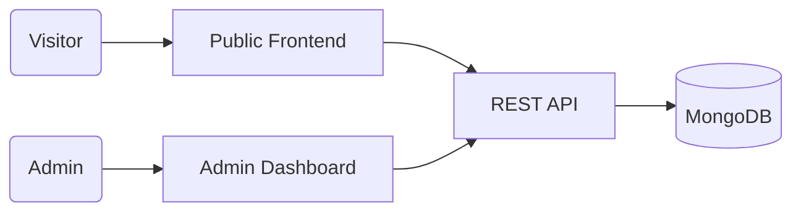

# 🚀 Full-Stack Portfolio Platform & Headless CMS


> **A high-performance, modular personal brand platform built to demonstrate advanced engineering capabilities in System Design, Security, and Scalability.**

---

## 🚀 Overview

This platform is more than just a portfolio; it's a **custom-built Headless CMS solution**. It solves the problem of static content by providing a secure, real-time administrative interface for managing projects, skills, and business inquiries without touching the codebase.

- **Problem solved**: Elimination of static site maintenance overhead.
- **Real-world use case**: Centralized hub for professional identity and lead generation.
- **Primary goal**: Demonstrate production-grade full-stack architecture.

---

## 🧰 Tech Stack

| Layer | Technology | Key Usage |
| :--- | :--- | :--- |
| **Frontend** | **React 18 + Vite** | High-performance SPA with Atomic Design. |
| **Styling** | **Tailwind CSS** | Responsive Design System & Glassmorphism UI. |
| **Backend** | **Node.js + Express** | RESTful API with Modular Middleware architecture. |
| **Database** | **MongoDB Atlas** | NoSQL document storage with Mongoose ODM. |
| **Security** | **JWT + Bcrypt** | Stateless Authentication & Hash-based security. |
| **Deployment** | **Render / Docker** | CI/CD automated pipeline for production. |

---

## 🔥 Key Features

- **🛡️ Secure Admin Dashboard**: Authenticated control panel for real-time CRUD operations.
- **⚡ Performance First**: Zero-clutter codebase resulting in near-instant LCP (Largest Contentful Paint).
- **🎨 Responsive UI**: Mobile-first approach ensuring seamless experience across all viewports.
- **📩 Lead Management**: Integrated contact system with backend validation and persistence.
- **Dynamic Content**: Data-driven architecture—no hardcoded projects or skills.

---

## 🧠 Architecture (High Level)

The system is designed with a **Separation of Concerns** principle.

- **Frontend**: Lightweight consumer of the API, utilizing React Context for global state.
- **Backend API**: Stateless service handling business logic, authentication, and data persistence.
- **Data Persistence**: Scalable NoSQL architecture optimized for flexible content schemas.



---

## 🛠️ Getting Started

For technical reviewers who wish to audit the implementation locally:

```bash
# Clone the repository
git clone https://github.com/placeholder/portfolio.git

# Install all dependencies
npm run install-all

# Launch the development environment (Concurrently)
npm run dev
```

---

## 📈 Technical Highlights

- **Modular MVC Implementation**: Strictly organized backend logic for maintainability.
- **Clean Code Standards**: Consistent naming conventions and DRY principles throughout.
- **Security Protocols**: Implementation of CORS, Helmet, and Payload Sanitization.
- **Scalable Design**: Prepared to integrate with Cloud Storage (S3/Cloudinary) for enterprise-level scaling.

---

## 💡 Why this project?

This project showcases my ability to transition from a "developer" to an **"engineer"**. Instead of relying on monolithic frameworks, I chose the MERN stack to demonstrate mastery over the full lifecycle of a web application: from database schema design to secure API implementation and responsive UI development.

---

## 🔮 Roadmap

- [ ] **AI-Driven Analytics**: Integrate ML to track project engagement.
- [ ] **Technical Blog**: Markdown-supported engine for thought leadership.
- [ ] **E2E Testing**: Full coverage with Cypress for critical admin flows.

---

## 👨‍💻 Author

**[David Rojas]**  
*Senior Full-Stack Developer*

[](https://linkedin.com/in/placeholder)
[](https://github.com/imDeiviz)
