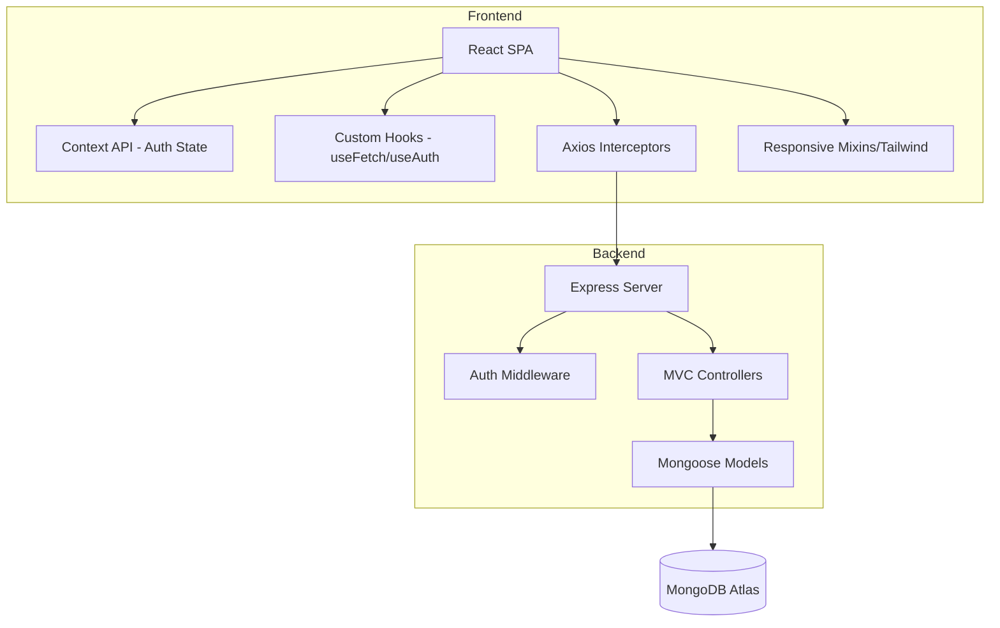

# 📕 Portfolio MERN - Developer Documentation

> **LEVEL: SENIOR ENGINEER**  
> This document provides a deep dive into the technical implementation, architectural decisions, and setup instructions required to reconstruct or extend the system.

---

## 🏗️ System Architecture

The project follows a **Decoupled Client-Server** pattern, designed for high scalability and separation of concerns.

### High-Level Flow
1. **Request Lifecycle**: `Client (Axios)` -> `Express Middleware (Auth/Upload)` -> `Controller` -> `Service/Model (Mongoose)` -> `MongoDB`.
2. **Auth Flow**: Proprietary JWT-based system.
   - **Login**: `/api/auth/login` generates a signed JWT.
   - **Persistence**: Token stored in local state/storage.
   - **Validation**: `protect` middleware verifies HMAC signature before granting access to Admin routes.

### Visual Architecture (Mermaid)


---

## 📱 Mobile-First Implementation details

### Public Section
- **Grid System**: Flexible `grid-cols-1 md:grid-cols-2 lg:grid-cols-3` pattern.
- **Typography**: Scalable `rem` units for all text.
- **Navigation**: Full-screen overlay menu for mobile accessibility.

### Admin Section
- **Drawer Pattern**: Side-navigation transforms into a smooth drawer overlay on mobile.
- **Split View Inbox**: Messages adapt from a side-by-side list to a toggled list/detail view.
- **Adaptive Modals**: CRUD interfaces transition to full-screen or bottom-sheet behavior on extra-small screens.
- **Fluid Grids**: Dashboard cards and project galleries use responsive breakpoints (`sm`, `md`, `lg`).

---

## 📁 Directory Structure & Module Design

### `/server` (The API Engine)
- **`config/`**: Database abstraction and environment management.
- **`controllers/`**: Pure business logic. Decoupled from routes for unit testability.
- **`middleware/`**: 
  - `protect.js`: RBAC (Role-Based Access Control) implementation.
  - `upload.js`: Multer configuration for stream-based image processing.
- **`models/`**: Strongly typed schemas with Mongoose middlewares (e.g., password hashing on save).
- **`routes/`**: Endpoint definitions following RESTful naming conventions.

### `/client` (The Consumer)
- **`src/components/admin/`**: High-density UI for data management.
- **`src/components/home/`**: Performance-optimized sections for the public view.
- **`src/services/api.js`**: Unified API client using Axios instances with predefined `baseURL` and `headers`.
- **`src/context/`**: Global state persistence (Authentication).

---

## 🧱 Construction Guide (Step-by-Step)

### 1. Project Initialization
```bash
mkdir portfolio-mern && cd portfolio-mern
npm init -y
npm i concurrently nodemon -D
```

### 2. Backend Foundation (MVC)
1. **Express Setup**: Configure CORS, JSON body-parsing, and global error handlers.
2. **DB Connection**: Mongoose singleton pattern with `auto-reconnect` logic.
3. **Security**: Implement `bcryptjs` for one-way hashing and `jsonwebtoken` for stateless sessions.

### 3. Frontend Implementation
1. **Scaffolding**: `npm create vite@latest client -- --template react`
2. **Styling**: Tailwind CSS integration with custom variants for the "Glassmorphism" theme.
3. **Routing**: `react-router-dom` with `ProtectedRoute` wrappers for Admin views.

### 4. Integration & Storage
1. **Multer**: Configured to store assets in `/uploads` with filename sanitization.
2. **Static Serving**: Express serves the `client/dist` folder in production to avoid CORS overhead and simplify deployment.

---

## 🚀 Production & Deployment

### Environment Configuration (.env)
```env
# CRITICAL FOR PROD
MONGODB_URI=mongodb+srv://...
JWT_SECRET=your_32_char_long_secret
CLIENT_URL=https://yourportfolio.com
NODE_ENV=production
PORT=5000
```

### Deployment Strategy (Render/Railway)
1. **Build Step**: `npm run build` in root (triggers `cd client && npm run build`).
2. **Engine**: Node.js 18+.
3. **Health Check**: Monitor `/api/health` for uptime metrics.

---

## ⚠️ Common Pitfalls & Debugging
- **CORS Issues**: Ensure `CLIENT_URL` doesn't have a trailing slash in the `.env` file.
- **JWT Expiry**: Default is set to 30d. For higher security, implement Refresh Tokens in `v2`.
- **Mongoose Buffer**: If the DB is slow, increase `connectTimeoutMS` in the config.

---

## 🛣️ Roadmap & Future Scaling
- [ ] **Redis Caching**: Layer for frequently accessed projects to reduce DB load.
- [ ] **Cloudinary Integration**: Fully serverless asset management.
- [ ] **Cypress E2E**: Critical path testing for the Lead Generation form.
